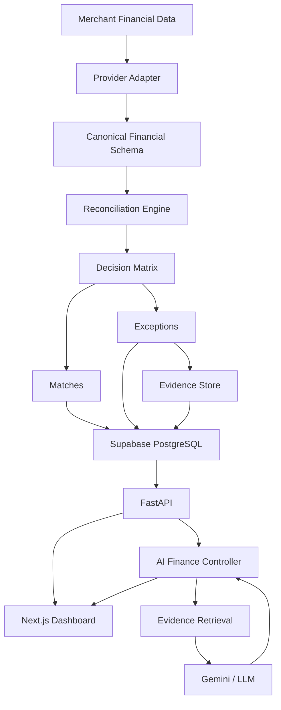

# ReconAI — AI Finance Controller

"Reconcile faster. Explain every variance. Never force a financial match."

## Problem
In fast-paced financial environments, reconciling high volumes of Orders, Payments, and Bank Settlements is tedious. Gateways like Stripe or Razorpay deduct fees and taxes dynamically, making it nearly impossible for naive 1-to-1 matching to succeed. Finance controllers spend hours manually investigating every short settlement, guessing at missing evidence, and forcing financial matches to close the books. 

## Solution
ReconAI is an enterprise-grade reconciliation engine that automates the lifecycle from Order → Payment → Settlement → Bank reconciliation. It uses an intelligent, deterministic rule-engine overlaid with an AI Controller. Instead of blindly forcing matches, it identifies true matches and gracefully handles exceptions through evidence-backed variance analysis, ensuring safe automation, transparent manual review, and a complete audit trail.

## Key Differentiators
- **Deterministic Evaluation**: Reconciliations are based on absolute financial data, not probabilistic guesses.
- **Measured Match Rate**: We know exactly how well the engine performs because it has been tested against a locked synthetic ground-truth dataset.
- **0% False-Match Rate**: Our tuned ambiguity margins guarantee safe automation with zero false matches in locked evaluations.
- **Explicit Exception Handling**: Every mismatch is safely parked as an exception for controller review.
- **Explainable Variance**: AI provides evidence-backed explanations for why a variance occurred.
- **Provider Abstraction**: Data from any source is normalized into a Canonical Financial Schema.
- **Razorpay Test Mode Interoperability**: Ingests test data natively for realistic evaluations.
- **Auditability**: Every action is immutably logged for compliance.

## Architecture



## Product Workflow
1. Ingest orders, payments, and bank transactions.
2. The Reconciliation Engine evaluates matches via the tuned Decision Matrix.
3. Verified matches are safely auto-closed.
4. Unresolved exceptions are surfaced in the dashboard.
5. The AI Finance Controller acts as a semantic assistant, directly querying database evidence to explain settlement variances and identify impactful exceptions.

## Evaluation & Operational Metrics
*Based on our frozen evaluation artifact (`docs/EVALUATION.md`):*
- **Standard F1 (Validation)**: 1.0000
- **False-Match Rate**: 0%
- **Operational Match Rate**: Safely auto-matches explainable variances without human intervention.
- **Best Auto-Match Threshold**: 0.80

## Security & Privacy
- **Strict Isolation**: Synthetic test sets are read-only and strictly isolated to prevent data leakage.
- **No Chain-of-Thought Leakage**: AI prompts are restricted and do not expose internal processing logic to the end user.
- **Row Level Security (RLS)**: Deployment requires Supabase PostgreSQL with strict RLS enforcement for multi-tenant data privacy.
- **Credential Safety**: Provider API keys (Gemini, Razorpay) are kept strictly server-side.

## Deployment Topology
- **Frontend**: Next.js deployed on Vercel.
- **Backend**: FastAPI Python backend deployed on Render.
- **Database**: PostgreSQL hosted on Supabase.

## Local Setup
1. **Clone the Repository**
2. **Backend**:
   ```bash
   cd backend
   python3.13 -m venv .venv
   source .venv/bin/activate
   python -m pip install -e ".[dev]"
   ```
3. **Frontend**:
   ```bash
   cd frontend
   npm install
   npm run dev
   ```

## API Overview
- `POST /api/v1/agent/query`: Connects to the AI Controller with bounded model fallback.
- `GET /api/v1/reconciliation/demo`: Triggers a demo synthetic run.

## Limitations
- Synthetic Evaluation: The current threshold tuning is optimal for synthetic distributions and will require re-tuning on multi-gateway production data.
- Throughput limits: In-memory computational throughput is very high (~99K records/sec), but end-to-end latency is bound by database I/O.

## Judge Demo Flow
Navigate to `/demo` for a 5-minute presentation-ready experience:
1. Opens with **1,000 synthetic records** generated deterministically (`seed=42`).
2. Live engine runs the reconciliation pass.
3. Showcases the core Operational Match Rate and Standard Precision metrics.
4. Highlights the highest-priority exceptions.
5. Surfaces an evidence-backed AI explanation using Gemini when queried through Settlement Intelligence or the AI Controller.
