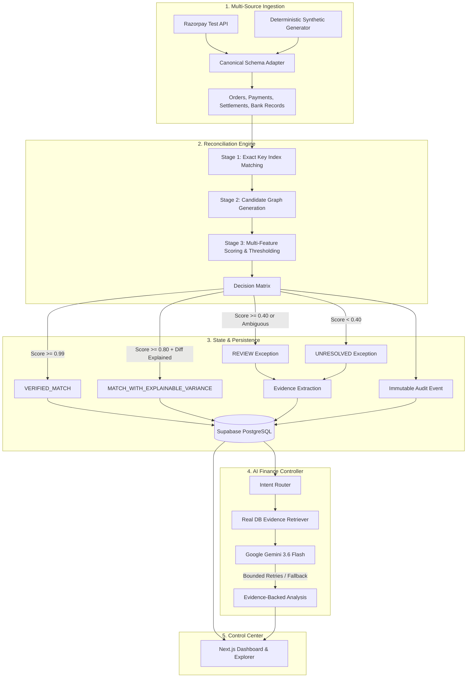

# ReconAI — AI Finance Controller

"Reconcile faster. Explain every variance. Never force a financial match."

## Problem
In modern high-volume payment environments, reconciling financial movements across Orders, Payment Gateways (like Razorpay/Stripe), and Core Banking settlements is brittle. Gateways deduct variable transaction fees and platform taxes dynamically. Naive 1-to-1 matching fails, forcing finance controllers to spend hours manually investigating settlement shortfalls, guessing missing fee evidence, and manually forcing matches to balance the ledger.

## Solution
ReconAI is an enterprise-grade financial reconciliation engine that automates the lifecycle from **Order → Payment → Settlement → Bank Transaction**. It employs a multi-stage deterministic decision matrix overlaid with an **Evidence-Grounded AI Controller**. Instead of blindly closing records with heuristic guesses, ReconAI auto-resolves explainable variances with mathematical guarantees, parks ambiguous cases in an exception queue with feature evidence, and provides an interactive AI Controller to investigate variances.

## Why ReconAI
- **Never Force a Match**: Built-in ambiguity margins flag conflicting candidates rather than making probabilistic guesses.
- **Explainable Variance Decomposition**: Separates gateway fees, GST taxes, and true cash discrepancies.
- **Measured Machine Accuracy**: Validated against locked test distributions with zero false matches.
- **Grounding Without Hallucination**: AI assistant responses are strictly bounded by real PostgreSQL evidence.
- **Multi-Gateway Abstraction**: Ingests raw data through Canonical Financial Schemas with native Razorpay Test Mode support.
- **Immutable Audit Trail**: Every ingestion, automated match, manual override, and review action is recorded.

## Architecture



## Decision Engine
ReconAI's multi-stage reconciliation pipeline:
1. **Stage 1 (Exact Match)**: Identifies absolute matches on Payment ID, Settlement Reference, and UTR with exact monetary equality.
2. **Stage 2 (Candidate Graph)**: Generates potential matching pairs within temporal and identifier similarity bounds.
3. **Stage 3 (Scoring & Thresholding)**:
   - **Verified Match** (`score >= 0.99`): Auto-closed with 100% confidence.
   - **Explainable Variance** (`score >= 0.80`): Verified relationship where variance is accounted for by gateway fee formulas.
   - **Ambiguity Margins**: If top 2 candidate scores are within `0.02`, marks as `AMBIGUOUS` to prevent false positive matches.
   - **Manual Review** (`0.40 <= score < 0.80`): Parked for human verification.
   - **Unresolved** (`score < 0.40`): Parked with detailed feature evidence.

## AI Finance Controller
- **Semantic Intent Routing**: Distinguishes greetings, capability queries, shortfall investigations, high-value exception filtering, and safe auto-close inquiries.
- **Evidence-Grounded Prompts**: Passes real database variance records (`variance_details`, `feature_name`, `confidence`) directly to Gemini.
- **Resilient Fallback Hierarchy**: Primary (`Gemini 3.6 Flash`) → Fallback 1 (`Gemini 3.5 Flash`) → Fallback 2 (`Gemini 3.5 Flash-Lite`) → Structured Deterministic Fallback.
- **Zero Hallucinated Amounts**: The AI Controller only explains amounts present in the retrieved database evidence.

## Evidence & Exception Handling
Every exception record in PostgreSQL is linked to granular feature evidence:
- `amount_difference`: Net cash shortfall
- `fee_variance`: Gateway fee discrepancy
- `utr_similarity`: Identifier string distance
- `timestamp_delta`: Timing skew across settlement windows

Finance controllers can inspect the financial chain, review feature evidence, approve matches, keep exceptions, or escalate with complete audit tracking.

## Evaluation & Operational Metrics
*Based on our frozen evaluation benchmark (`backend/evaluation/final/metrics.json`):*
- **Standard Precision**: 1.0000 (0% False-Match Rate)
- **Standard F1 Score**: 1.0000
- **Safe Auto-Match Precision**: 1.0000
- **Engine Computational Throughput**: **179,906 scenarios/sec** *(local in-memory rule benchmark)*

## Operational Metrics
- **Operational Match Rate**: Percentage of records safely auto-closed (Verified + Explainable).
- **Manual Review Rate**: Ambiguous or borderline records safely escalated to controllers.
- **Exception Rate**: High-risk discrepancies requiring human investigation.

## Judge Demo Flow
Navigate to `/demo` for a presentation-ready experience:
1. **Deterministic Run**: Executes against **1,000 synthetic records** (`seed=42`).
2. **Real-time Pipeline**: Runs live candidate matching and persists matches, exceptions, evidence, and audit logs.
3. **Operational Metrics**: Inspects live operational match rate and throughput.
4. **Top Exception Drill-down**: Click "Investigate Top Priority" to inspect the financial chain and failed feature evidence.
5. **AI Controller**: Ask questions like *"Why is today's settlement short?"* to receive evidence-backed explanations.

## Security & Privacy
- **Server-Side Credentials**: Gemini API keys, Razorpay secrets, and database connection strings are never exposed in frontend bundles.
- **Row Level Security (RLS)**: Enabled on all tables (`reconciliation_runs`, `reconciliation_matches`, `exceptions`, `exception_evidence`, `audit_events`).
- **Prompt Safety**: Prompts strictly forbid leaking internal system instructions or chain-of-thought tokens.
- **Test Set Isolation**: Evaluation datasets and ground-truth answer mappings are isolated and read-only.

## Deployment Topology
- **Frontend**: Next.js 16 (App Router) deployed on Vercel.
- **Backend**: FastAPI on Python 3.13 deployed on Render.
- **Database**: PostgreSQL hosted on Supabase.

## Limitations
- **Synthetic Distribution Tuning**: Production deployment with new gateways requires calibrating fee thresholds against historical gateway statement distributions.
- **Database I/O Bound**: While in-memory scoring processes 179k ops/sec, overall batch completion time is governed by PostgreSQL network latency.

## Local Setup
1. **Clone the Repository**
   ```bash
   git clone https://github.com/Kishan-shah12/AI-Finance-Controller.git
   cd AI-Finance-Controller
   ```
2. **Backend Setup**:
   ```bash
   cd backend
   python3 -m venv .venv
   source .venv/bin/activate
   pip install -e ".[dev]"
   uvicorn main:app --reload --port 8000
   ```
3. **Frontend Setup**:
   ```bash
   cd frontend
   npm install
   npm run dev
   ```
4. Open [http://localhost:3000](http://localhost:3000) to view the Finance Control Center.

## API Overview
- `POST /api/v1/reconciliation/run`: Start a batch reconciliation run.
- `GET /api/v1/reconciliation/demo/latest`: Fetch latest completed demo run.
- `GET /api/v1/exceptions`: List unresolved and review exceptions.
- `GET /api/v1/exceptions/{id}`: Detailed exception view with evidence chain.
- `POST /api/v1/exceptions/{id}/action`: Execute controller action (`APPROVE_MATCH`, `KEEP_EXCEPTION`, `ESCALATE`).
- `POST /api/v1/agent/query`: Query the AI Finance Controller.
- `GET /api/v1/evaluation/final`: Retrieve locked evaluation metrics.
- `GET /api/v1/audit`: Retrieve immutable audit trail events.
- `GET /api/v1/providers/status`: Check status of Razorpay and Synthetic providers.
